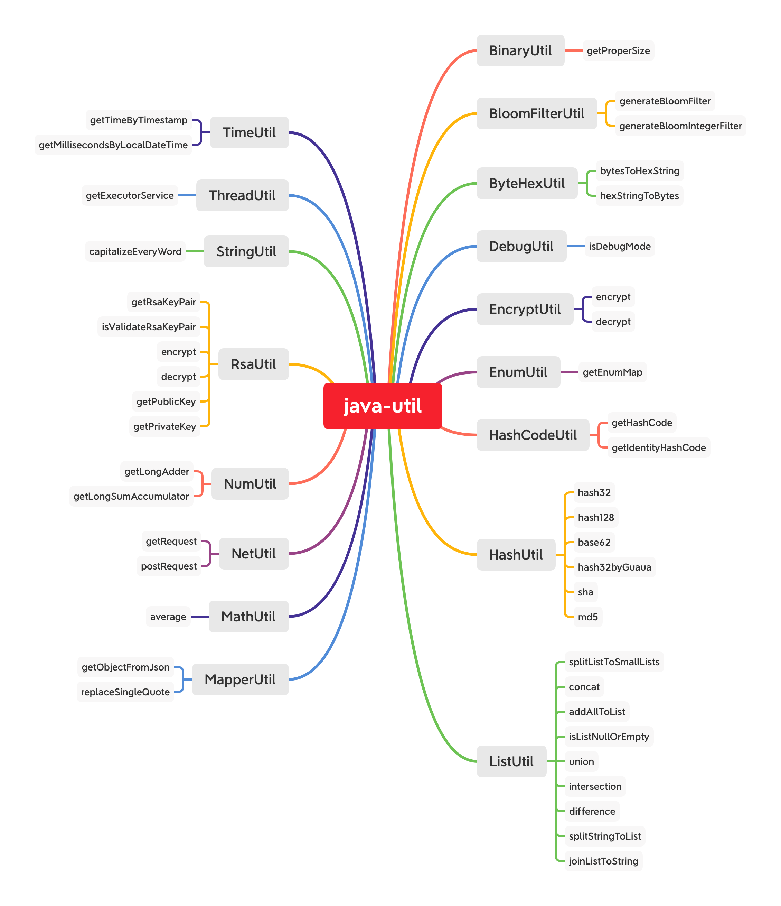

# Java Utils

<p align="center">
    <p align="center">
        
        <a href="https://github.com/zzh1991/Java-Util/blob/master/LICENSE"></a>
        <a href="https://snyk.io//test/github/zzh1991/Java-Util?targetFile=pom.xml"></a>
    </p>
    <p align="center">
        Useful utils for Java application<br>
    </p>
</p>

## java util map



### Maven package

```bash
./mvnw clean package
```

### [Java Doc](https://blog.zzhpro.com/Java-Util/)

```bash
./mvnw javadoc:javadoc
```

### Maven deploy

```bash
./mvnw deploy
```

## Todo

- [x] [maven package in GitHub](https://github.com/zzh1991/Java-Util/packages/)
- [x] Java API Doc
- [x] Utils Mind Map

## Build artifacts
> Intellij IDEA
```
1. Project Structure
2. Project Settings -> Artifacts
3. + -> Jar -> From modules with dependencies
4. Build -> Build Artifacts
```

## Author

👤 **Zhihao Zhang**

- Github: [@zzh1991](https://github.com/zzh1991)

## Show your support

Please ⭐️ this repository if this project helped you!

## 📝 License

Copyright © 2019-2020 [zzh1991](https://github.com/zzh1991).<br />
This project is [MIT](https://github.com/zzh1991/Java-Util/blob/master/LICENSE) licensed.
